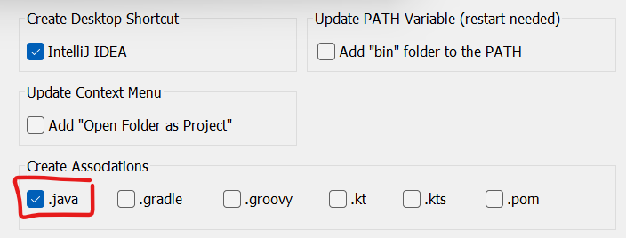
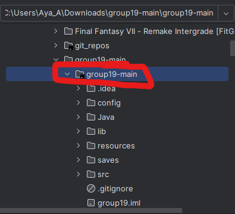
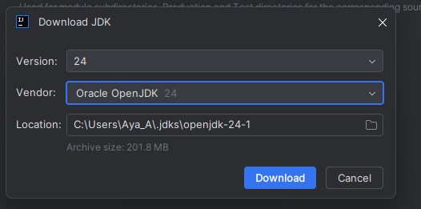
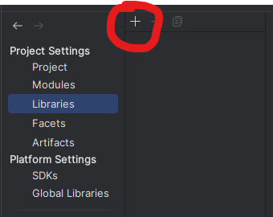
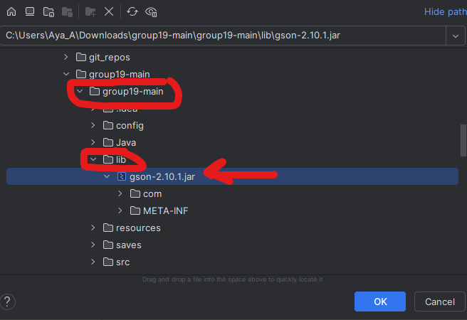
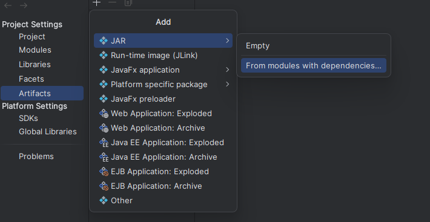
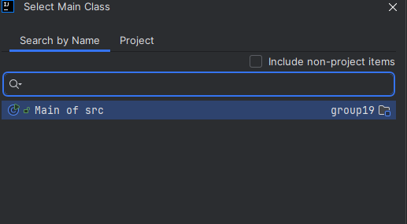
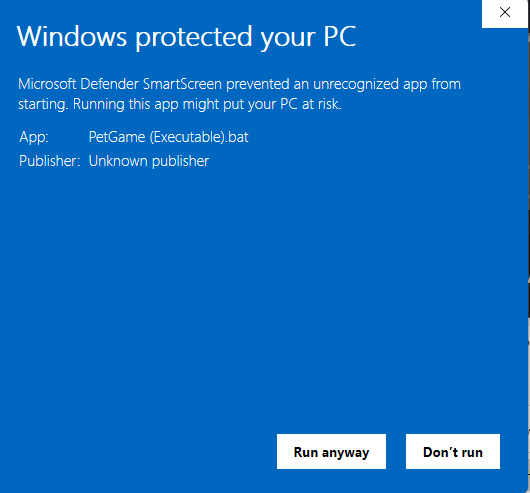

## Description of the game:
A Java desktop application simulating pet care, where players manage a digital pet's needs (hunger, happiness, health, sleep) through a mouse/keyboard GUI.

Some key features include:
- Feeding your pet to increase its fullness
- Playing or giving it a gift to increase happiness
- Putting it to bed to increase energy level (no longer sleepy)
- Exercising it to increase its health (lowers fullness and energy)
- Taking it to the vet to increase its health
- Parental controls: Reviving a pet, setting play times, resetting play times, and resetting play minutes

#### **Required Libraries/Tools/IDEs**
- Versions of IntelliJ above 2024.3.4.1
- Java SDK 23+
- Gson (JSON serialization-this comes with the zip file)

### HOW TO INSTALL?
1. If you don't already have IntelliJ installed, install IntelliJ IDEA (any version, as of today, the latest version is 2024.3.5)
2. After you install IntelliJ, run the .exe file (if on Windows, if on mac, it will be a dmg file)
   3. if you are on mac, double click on the downloaded DMG file
   4. Drag the IntelliJ IDEA icon from the mounted disk image to the applications folder (your computer will tell you to do this)
   5. Find and open IntelliJ from the applications folder
3. If you are on Windows, run the .exe file after it finishes downloading
4. Click okay if it asks you if you want it to make any changes
5. Click on next -> "Destination Folder" is usually fine where the default is, you can move it if you want -> Make sure to tick off ".java" under "Create Associations"

6. For the Start Menu folder, keep it as the default "JetBrains"
7. Finally, click install, After it is done, click on "Run IntelliJ IDEA" then Finish
8. Assuming the group19-main.zip is extracted (if not, extract it), in IntelliJ, click on "Open" and navigate to the extracted "group19-main.zip" folder. Click on the arrow pointing to it, then click on the interior "group19-main" folder

Confirm this open by clicking "Open"
9. After it is opened, to ensure JDK is installed, right click on "group19-main" under the Projects and go all the way down to "Open Module Settings"
10. When opened, click on "Project" under the "Project Settings" tab

11. If you do not have an SDK installed, click on the arrow button inside the tab and select "Download JDK"
12. The default JDK that shows up is the correct one. Click on "Download"

13. After that, click "Apply"
14. To make sure JSON is installed, go to "Libraries" under "Project Settings" and click on the plus if nothing is there

15. After that, go to "Java" then navigate to lib under group19-main, select gson2.10.1.jar. Click on "Ok"

16. After that, click on Apply once more
17. Then, navigate to "Artifacts" under Project Settings. Once again, if it is empty, click on the plus then select JAR -> From modules and dependencies

18. When you are prompted with the popup, click on the folder icon beside "Main Class"
19. Wait until "Main of src" appears under "Search by Name". When it does, click on it then click "Ok"

20. Click "Apply" then click on "Ok"
21. Finally, navigate to the "Build" option in the "Main Menu" tab and select on the "Build Artifact" option

22. A small popup will appear in the middle of the screen, click on "Build" and wait for it to finish
23. After it finishes, go to where you have "group19-main" saved and double click on "Pet Game (Executable).bat" and the game should run! Enjoy!

If you are presented with the error that Windows is preveting you from running the program, click on "More" and force it to run by clicking "Run anyway"

